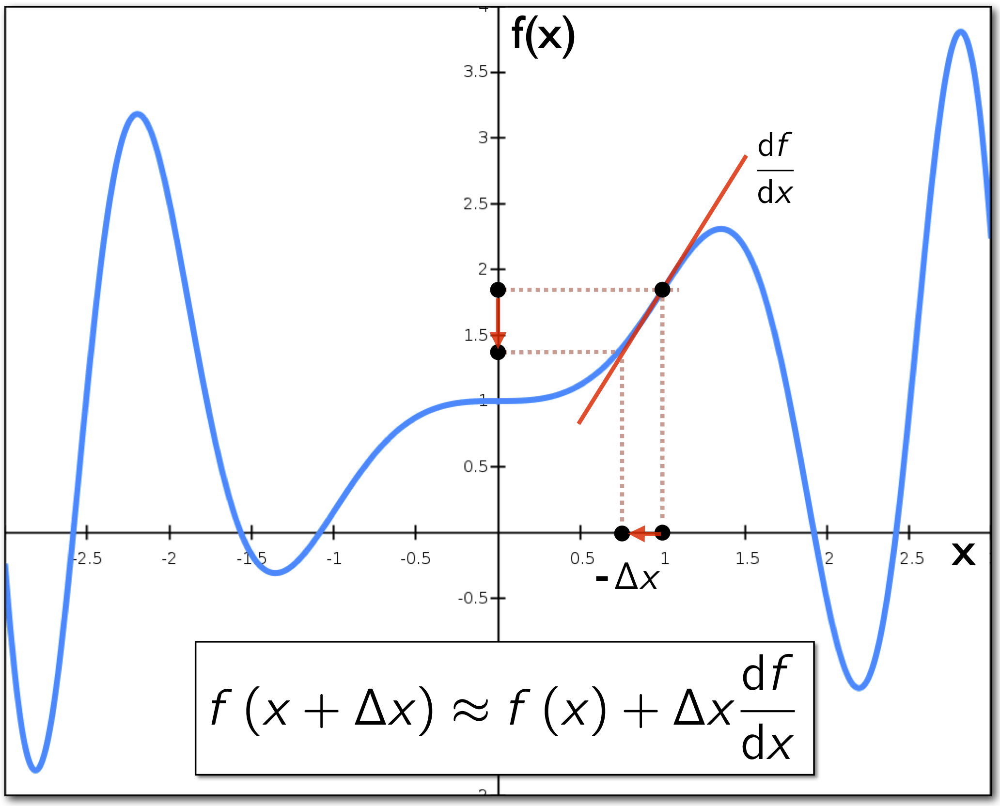

# The gradient-descent algorithm

##Review of derivatives of functions
#### Derivative of a scalar function of a single scalar variable

Before we present the gradient-descent algorithm, we will briefly review the concept of derivative of a function. Let $f$ be a scalar function of a single variable $x$. The derivative of the function w.r.t. $x$ is: 
$$
\begin{align}
        \frac{df}{dx} = \lim_{\Delta x \rightarrow 0}\frac{\Delta f}{\Delta x} = \lim_{\Delta x \rightarrow 0}\frac{f\left(x+\Delta x\right) - f\left(x\right)}{\Delta x}.
	\label{dfx0}
\end{align}
$$
The derivative of a scalar function describes the slope (i.e., rate of change) of the function at a point $x$. 

Figure 1 shows the graph of the function $f(x) = x\sin x^2 + 1$. It also shows red tangent lines representing the function's derivatives at $x=-1$, $-0.5$, $0.5$, and $1$. The derivative of function $f$ in this example is $\dfrac{df}{dx}\left(x\right) = 2x^2\cos x^2 + \sin x^2$.

**Figure 1**: The graph of function $f(x) = x\sin x^2 + 1$. Red tangent lines indicate the function's derivative calculated at $x=-1$, $-0.5$, $1$, $0.5$, and $1$. The derivative measures the slope of the function at a given point. 

#### Using differences to approximate derivatives 

We can approximate the derivative numerically by using discrete differences. In fact, as long as we can evaluate the function, we can always approximate the derivative, i.e.: 
$$
\begin{align}
        \frac{df}{dx} \approx \frac{\Delta f}{\Delta x} = \frac{f\left(x+\Delta x\right) - f\left(x\right)}{\Delta x},
	\label{approx}
\end{align}
$$
for a small $\Delta x$. Figure 2 shows the approximate derivative of the function for a small $\Delta x$. 

**Figure 2**: The approximate derivative of the function $f(x) = x\sin x^2 + 1$ at $x=-1$.

####Calculating the value of functions at nearby points

The derivative of a function calculated at a certain point can be seen as a linear approximation of the function at that point. We can also use derivatives to calculate the value of a function at nearby points. Given the value of a function at a point, $f(x)$, and its derivative, $df/dx$, we can estimate the value of the function at a point near $x$, i.e.: 
$$
\begin{align}
        \frac{\Delta f}{\Delta x} &\approx \frac{df}{dx}   \notag  \\ 
         {\Delta f} &\approx  {\Delta x} \frac{df}{dx}  \notag \\ 
         f\left(x+\Delta x\right) - f\left(x\right) &\approx  {\Delta x} \frac{df}{dx}  \notag \\ 
         f\left(x+\Delta x\right) &\approx   f\left(x\right) + {\Delta x} \frac{df}{dx}.  
	\label{nearby}
\end{align}
$$

**Figure 3**: Derivatives allow us to calculate the value of a function at nearby points. Given the value of a function at a point, $f(x)$, and its derivative, $df/dx$, we can estimate the value of the function at a point near $x$ 

## The gradient-descent algorithm

Often, we want to find the value for which a function is zero, i.e., we want to find solutions to the equation $f\left(x\right) = 0$. This equation can be solved analytically or numerically by means of numerical-optimization methods. One of these methods is the *gradient-descent* method. 

#### Following the slope to get to a desired point in the function 

If we can evaluate $f\left(x\right)$ and $df/dx$ for any value of $x$, then we can always follow the slope (i.e., gradient) in the direction towards 0. The basic steps are: Starting at some initial value $x_0$, take small steps until we find a value $x_n$ for which $f\left(x_n\right) = 0$. Taking the small step can be written as:
$$
\begin{align}
        x_{i+1} = x_i + \Delta x. 
	\label{steps}
\end{align}
$$
For each step, we choose a value of $\Delta x$ that brings us closer to our goal. 

####Determining a suitable step $\Delta x$ 

The question now is which step (i.e., magnitude and direction) should we take that will make us reach our goal? Because we plan to follow the slope of the function (i.e., its linear approximation given by the derivative), we can use the local approximation of the function value at nearby points, i.e.: 
$$
\begin{align}
  f\left(x+\Delta x\right) &\approx   f\left(x\right) + {\Delta x} \frac{df}{dx}.  
	\label{nearby2}
\end{align}
$$

##### Step for which the value of the function reaches zero 

To find the step $\Delta x$ that takes the value of the function closer zero, we set $f\left(x+\Delta x\right) = 0$. Under this condition, we can then re-write Equation $\ref{nearby2}$ and re-arrange it to obtain the step $\Delta x$ as follows:
$$
\begin{align}
  0 &\approx   f\left(x\right) + {\Delta x} \frac{df}{dx}  \notag \\
  - f\left(x\right) &\approx {\Delta x} \frac{df}{dx} \notag \\
  - f\left(x\right) \left(\frac{df}{dx}\right)^{-1} &\approx {\Delta x} \left(\frac{df}{dx}\right)^{-1}\left(\frac{df}{dx}\right) \notag \\
  - f\left(x\right) \left(\frac{df}{dx}\right)^{-1} &\approx {\Delta x} \notag \\
   {\Delta x} &= -f\left(x\right) \left(\frac{df}{dx}\right)^{-1}.    \label{nearby3}
\end{align}
$$

##### Step for which the value of the function reaches a given value g

If we want to find where the value of the function equals some value $g$ instead of $0$, we can think of the problem as minimizing $f\left(x\right) - g$ and just step towards $g$, i.e.: 
$$
\begin{align}
          {\Delta x}  &= \left(g - f\left(x\right) \right) \left(\frac{df}{dx}\right)^{-1}.
	\label{choosingDeltaxStepToG}
\end{align}
$$
##### Move in the direction provided by $\Delta x$, but move carefully 

Equation $\ref{choosingDeltaxStepToG}$ assumes that the linear approximation of the function given by its derivative is reliable for large values of $\Delta x$. This assumption, however, does not hold for non-smooth functions with varying derivatives. A safer way to procede is to multiply $\Delta x$ by a parameter $\lambda\in \left(0,1\right]$ to scale the step down. When including the $\lambda$ scale factor, Equation $\ref{choosingDeltaxStepToG}$ becomes:  
$$
\begin{align}
          {\Delta x}  &= \lambda \left(g - f\left(x_i\right) \right) \left(\frac{df}{dx}\right)^{-1}.
	\label{scaledDeltaxStepToG}
\end{align}
$$

**Figure 4**: Computing the gradient descent's $\Delta x$ step. The red arrow shows a step that was computed  using ${\Delta x} = \left(g - f\left(x_i\right) \right) \left({df}/{dx}\right)^{-1}$, which may be too large (and over optimistic) given the function's linear approximation $df/dx$. In contrast, the green arrow shows a (smaller) step that was computed using ${\Delta x} = \lambda\left(g - f\left(x_i\right) \right) \left({df}/{dx}\right)^{-1}$, with $0<\lambda\leq 1$. For instance, we can set $\lambda= 0.1$.

Finally, for a scalar function of a single scalar variable, we have that: 
$$
\left(\frac{df}{dx}\right)^{-1} = \frac{1}{\left(\frac{df}{dx}\right)} = \frac{dx}{df} = \frac{1}{s}, 
$$
where $s$ is the slope of the function at $x$. 

#### The algorithm 

The pseudo-code steps of the gradient-descent algorithm is listed in Algorithm 1. 

